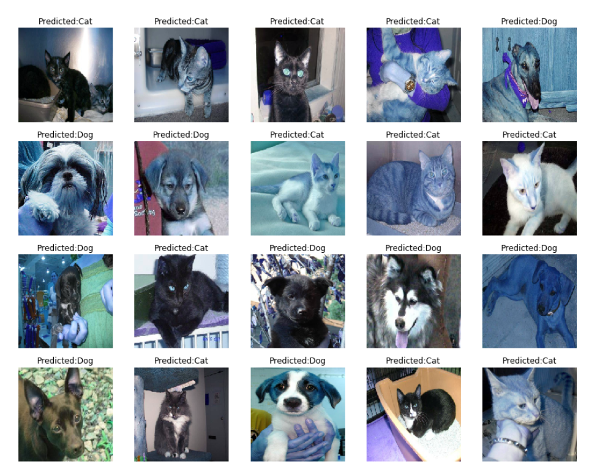

# Cats-or-Dogs-using-CNN-with-Transfer-Learning
A deep learning model to classify between dogs and cats using transfer learning with RESNET50  

Libraries used :  
Tensorflow  
Keras  
Numpy  
Matplotlib  
Pandas  
Seaborn  
Sklearn  
Tqdm  
Random  
openCV   

The data set can be downloaded from below links and extracted inside the input folder:  
https://www.kaggle.com/c/dogs-vs-cats-redux-kernels-edition  
https://www.kaggle.com/keras/resnet50

The Output looks like : 

